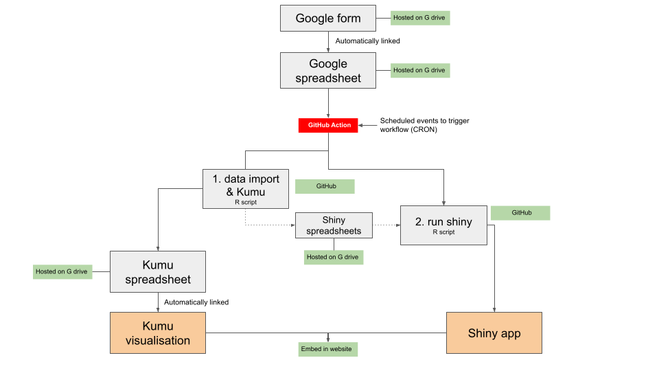

class: center, middle

# title

### subtitle

---

# Overview

We share the data pipeline process we are using to collect and visualise data collected on Digital Humanities (DH), Computational Social Sciences (CSS), Human Language Technologies (HLT) and Natural Language Processing (NLP) activities and initiatives in South Africa. The aim of collecting this data is to enable the landscape of these initiatives in South Africa to be known.

---

# Aim

To capture data with a Google Form and then create data visualisations in Kumu (and Shiny, which is still in development) through a non-interactive automated process.

```{r echo=FALSE, out.height="100%", out.width= "100%"}

```

---


